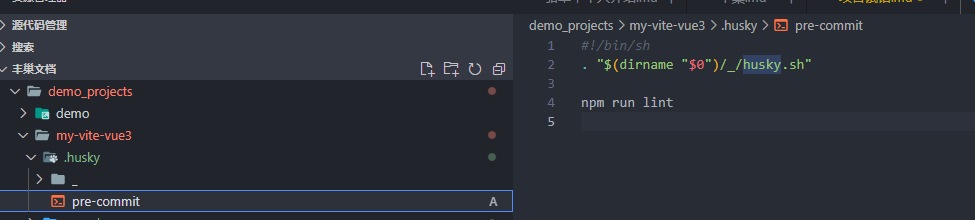

# Vue 3 + TypeScript + Vite

This template should help get you started developing with Vue 3 and TypeScript in Vite. The template uses Vue 3 `<script setup>` SFCs, check out the [script setup docs](https://v3.vuejs.org/api/sfc-script-setup.html#sfc-script-setup) to learn more.

## Recommended IDE Setup

- [VS Code](https://code.visualstudio.com/) + [Volar](https://marketplace.visualstudio.com/items?itemName=johnsoncodehk.volar)

## Type Support For `.vue` Imports in TS

Since TypeScript cannot handle type information for `.vue` imports, they are shimmed to be a generic Vue component type by default. In most cases this is fine if you don't really care about component prop types outside of templates. However, if you wish to get actual prop types in `.vue` imports (for example to get props validation when using manual `h(...)` calls), you can enable Volar's Take Over mode by following these steps:

1. Run `Extensions: Show Built-in Extensions` from VS Code's command palette, look for `TypeScript and JavaScript Language Features`, then right click and select `Disable (Workspace)`. By default, Take Over mode will enable itself if the default TypeScript extension is disabled.
2. Reload the VS Code window by running `Developer: Reload Window` from the command palette.

You can learn more about Take Over mode [here](https://github.com/johnsoncodehk/volar/discussions/471).

### eslint.js 和 prettierrc.json 配置

eslint 是用来校验格式
prettierrc 是用来修改格式

eslint 可以直接通过 npx eslint index.js 命令来校验，会提示在终端中；如果想要在每个文件里面提示，需要在 vscode 中下载插件 eslint；

```
// eslint 在package.json里配置
{
//--ext后面需要写上指定检测文件的后缀，如.js、.jsx、 .vue等，紧接着后面要写上一个参数，这个参数就是我们要检测哪个目录下面的文件，一般项目文件都在src下面，所以在后面写上src/就好
"lint": "eslint --ext .js --ext .jsx --ext .vue src/"
// 会自动修复eslint问题
"lint-fix": "eslint --fix --ext .js --ext .jsx --ext .vue src/"
}
```

prettier 可以通过 npx prettier --write index.js 命令来修改；如果要自动保存时修改，需要先在 setting.js 中设置自动保存后，再下载 prettier 插件；
husky 提交代码前的校验

eslint vite 项目下载 npm 包：
eslint-config-standard eslint-plugin-import eslint-plugin-promise eslint-plugin-node
husky 操作步骤：

- 方法一：
  1.npm i -D husky
  2.npx husky install // 创建 husky 目录，并初始化
  3.npx husky add .husky/pre-commit 'npm run lint' // 创建 pre-commit，并执行 package.js 里面的 npm run lint
  
- 方法二：
  1.npm i -D husky@4.3.8 @commitlint/config-conventional commitlint

  ```
  // commitlint.config.js规范
  build：主要目的是修改项目构建系统(例如 glup，webpack，rollup 的配置等)的提交
  ci：主要目的是修改项目继续集成流程(例如 Travis，Jenkins，GitLab CI，Circle等)的提交
  docs：文档更新
  feat：新增功能
  merge：分支合并 Merge branch ? of ?
  fix：bug 修复
  perf：性能, 体验优化
  refactor：重构代码(既没有新增功能，也没有修复 bug)
  style：不影响程序逻辑的代码修改(修改空白字符，格式缩进，补全缺失的分号等，没有改变代码逻辑)
  test：新增测试用例或是更新现有测试
  revert：回滚某个更早之前的提交
  chore：不属于以上类型的其他类型

  module.exports = {
    extends: ['@commitlint/config-conventional']
  };
  ```

  2.package.json

  ```
  "husky": {
    "hooks": {
      "commit-msg": "commitlint -e $HUSKY_GIT_PARAMS"
    }
  }
  ```

### stylelintrc.js 配置

CSS 代码检查工具 stylelint

1. 下载 npm install --save-dev postcss-scss postcss-html stylelint-config-recommended-vue stylelint-config-standard-scss stylelint
2. 在.stylelintrc.js 中配置

```
module.exports = {
  extends: ['stylelint-config-standard-scss', 'stylelint-config-recommended-vue/scss', 'stylelint-config-recess-order'],
  rules: {
    'order/properties-order': ['color', 'padding', 'color', 'margin-top']
  }
};
```

3.在 setting.js 中配置

```
{
  // stylelint 需要检查的文件
  "stylelint.validate": [
    "css",
    "less",
    "postcss",
    "scss",
    "vue",
    "sass"
  ],

}
```

### package.json 中的设置

- 配置

```
{
    "dev": "cross-env NODE_ENV=development vite",
    "build": "vue-tsc --noEmit && vite build",
    // 用作预览本地构建，而不应直接作为生产服务器。先 npm run build && npm run preview
    "preview": "vite preview",
    // vue-tsc --noEmit 构建之前添加 tsc 校验,再次打包，错误代码被校验出来，打包失败
    "typecheck": "vue-tsc --noEmit",
    // 分析打包产物
    "report": "set report=true&& vite build",
    "eslint": "eslint --fix --ext .js --ext .jsx --ext .ts --ext .tsx --ext .vue src/",
    "stylelint": "stylelint **/*.{html,vue,css,scss}",
    "lint": "npm run typecheck && npm run eslint && npm run stylelint",
    "lint-fix": "npm run eslint -- --fix && npm run stylelint -- --fix",
    // husky 提交代码前的校验
    "prepare": "husky install"
}
```

- eslint Vue3 一直报错 error: Parsing error: Unexpected token 解决方法(在 vue3 ts 中的解决办法)

  1.安装依赖 eslint-plugin-vue @typescript-eslint/parser @typescript-eslint/eslint-plugin
  2.eslintrc.js 文件中的配置

  ```
  module.exports = {
    parserOptions: {
      parser: '@typescript-eslint/parser'
    },
    parser: 'vue-eslint-parser',
    extends: ['plugin:vue/vue3-recommended', 'plugin:@typescript-eslint/recommended', 'prettier'],
  }
  ```

- vite2 添加类似 webpack-bundle-analyzer 依赖分析插件

```
import vue from "@vitejs/plugin-vue";
import visualizer from "rollup-plugin-visualizer";

const plugins = [];

// 打包生产环境才引入的插件
if (process.env.NODE_ENV === "production") {
    // 打包依赖展示
    plugins.push(
        visualizer({
            open: true,
            gzipSize: true,
            brotliSize: true,
        })
    );
}

export default defineConfig({
    plugins: [
          vue(),
          ...plugins
    ]
})
```

### 项目中 git 的配置

可以同时配置公司 gitlab 和 github 的 git 登陆方式

参考链接是：<https://www.cnblogs.com/lfr0123/p/13477001.html>

- 公司邮箱配置

  - 配置公司邮箱
    ssh-keygen -t rsa -C "公司邮箱地址"

  \*用记事本打开 id_rsa.pub，复制有所内容

- github 邮箱配置

  - 配置 github 邮箱
    ssh-keygen -t rsa -C "github 邮箱地址" -f ~/.ssh/github_rsa

    - github_rsa.pub 中的内容配置到自己的 github 上

- 在.ssh 中配置 config 文件

```
# 自己的github账号配置
Host github.com
   port 22
    User git
    HostName github.com
    PreferredAuthentications publickey
    IdentityFile C:\Users\xiaoqq\.ssh\github_rsa

# 公司的gitlab账号配置(HostName为公司的gitlab地址)
Host gitlab.com
    port 22
    User git
    HostName gitlab.xxx.com
    User git
    PreferredAuthentications publickey
    IdentityFile C:\Users\xiaoqq\.ssh\id_rsa

Host
    Host可以看作是一个你要识别的模式，对识别的模式，配置对应的主机名和ssh文件
Port
    自定义的端口。默认为22，可不配置
User
    自定义的用户名，默认为git，可不配置
HostName
    真正连接的服务器地址
PreferredAuthentications
    指定优先使用哪种方式验证，支持密码和秘钥验证方式
IdentityFile
    指定本次连接使用的密钥文件

```

- 验证是否成功

```
# 测试 github

ssh -T git@github.com

# 测试 gitlab(@符后面的为公司 gitlab 地址)

ssh -T git@gitlab.xxx.com
```

- git config 配置权重
  仓库级别 local 【优先级最高】
  用户级别 global【优先级次之】
  系统级别 system【优先级最低】

```
用户级别配置

用户级别是配置公司gitlba账号还是自己github账号，可以自由选择。因为平常使用公司的代码频率较高，所以我选择将gitlab账号配置成用户级别。gitBath下执行如下命令：

git config --global user.name 'lfr' #公司账号名称
git config --global user.email 'lfr@company.com' #公司账号邮箱
```

```

仓库级别配置


local（仓库级别）配置成github的账号。选择一个文件夹作为github的本地仓库，在该文件夹里鼠标右键打开Git Bash Here，执行命令：git init

再执行命令：

git config --local user.name 'username' #github账号名称
git config --local user.email 'username@gmail.com' #github账号邮箱
```

### 如下报错：fetch-pack: invalid index-pack output

```
解决方案：浅拉取最后一次提交的

git clone -b 分支名 --depth=1 仓库路径
```

### ssh-keygen 常用参数

-t：指定生成密钥的类型，默认使用 SSH2d 的 rsa
-f：指定生成密钥的文件名，默认 id_rsa（私钥 id_rsa，公钥 id_rsa.pub）
-P：提供旧密码，空表示不需要密码（-P ‘’）
-N：提供新密码，空表示不需要密码(-N ‘’)
-b：指定密钥长度（bits），RSA 最小要求 768 位，默认是 2048 位；DSA 密钥必须是 1024 位（FIPS 1862 标准规定）
-C：提供一个新注释
-R hostname：从 known_hosta（第一次连接时就会在家目录.ssh 目录下生产该密钥文件）文件中删除所有属于 hostname 的密钥

```
ssh-keygen -R 106.13.4.108
```
